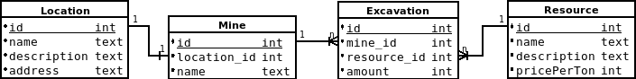

# Spring REST api

### Sample REST application based on Spring boot. 

### ERD:

### possible operations (JSON):
- get/add/edit/delete location
- get/add/edit/delete Mine
- get/add/edit/delete Excavation
- get/add/edit/delete Resource

### additional features:
- email sender (sending info about requests with code 500+)
- logs (log file with all requestes)

